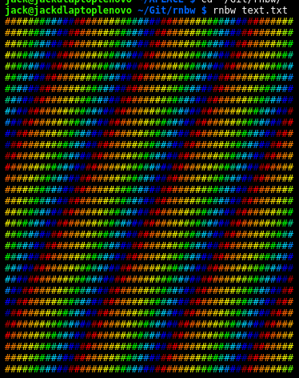
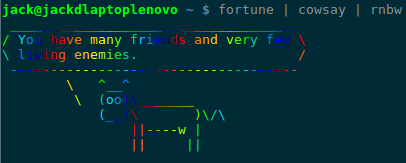

[](https://github.com/jman294/rnbw)

# rnbw
Rainbows for life

## What does this module do?
It *rainbowifies* text:




## To use

`npm install rnbw`

This can either be used as a module as such:
```javascript
var rnbw = require('rnbw')

rnbw.rainbow('the text to rainbow')
rnbw.colorify(45, 'some text to color based on that number (look up ANSI escape sequences)')
```

Or as a command line tool:
`./node_modules/bin/rnbw text.txt`

__Have fun rainbowing!__
